# PP_00_00

- 피플리 재직 중 주요 국공립 기관 및 글로벌 IP 전시의 실감형 미디어 시스템을 구축한 내용입니다.  
- 18개의 프로젝트, 50개의 프로그램 개발에 참여하였으며,  
키오스크 UI/UX부터 특수 센서 연동, 1:N 멀티 동기화 아키텍처 및 자체 R&D 컴포넌트 개발까지 전시 솔루션 전 과정을 주도했습니다.  

<table>
  <tr>
    <th width="10%">구분</th>
    <th width="30%">프로젝트</th>
    <th width="30%">콘텐츠</th>
    <th width="10%">개수</th>
    <th width="20%">기타</th>
  </tr>
  <!-- 하리보 100주년 -->
  <tr>
    <td align="center">IP전시</td>
    <td>골드베렌의 100주년 생일 기념전 WELCOME TO THE HARIBO WORLD</td>
    <td>인터랙티브 콘텐츠</td>
    <td align="center">1</td>
    <td>리얼센스 활용 바디 트래킹</td>
  </tr>
  <!-- 국중박 기증관 -->
  <tr>
    <td align="center" rowspan="2">박물관</td>
    <td rowspan="2">국립중앙박물관 기증관</td>
    <td>키오스크</td>
    <td align="center">2</td>
    <td>안드로이드 OS</td>
  </tr>
  <tr>
    <td>키오스크</td>
    <td align="center">1</td>
    <td>-</td>
  </tr>
  <!-- ACC -->
  <tr>
    <td align="center" rowspan="2">박물관</td>
    <td rowspan="2">광주 국립아시아문화전당</td>
    <td>키오스크</td>
    <td align="center">1</td>
    <td>-</td>
  </tr>
  <tr>
    <td>미니게임</td>
    <td align="center">1</td>
    <td>-</td>
  </tr>
  <!-- 청계천 -->
  <tr>
    <td align="center">박물관</td>
    <td>청계천박물관</td>
    <td>미디어월 콘텐츠</td>
    <td align="center">1</td>
    <td>4K UHD x6 </td>
  </tr>
  <!-- 국립부여박물관 -->
  <tr>
    <td align="center" rowspan="2">박물관</td>
    <td rowspan="2">국립부여박물관 백제목간전</td>
    <td>인터랙티브 콘텐츠</td>
    <td align="center">1</td>
    <td>RFID 연동, 프로젝션 매핑</td>
  </tr>
  <tr>
    <td>키오스크</td>
    <td align="center">1</td>
    <td>-</td>
  </tr>
  <!-- 수도국산 -->
  <tr>
    <td align="center">박물관</td>
    <td>수도국산달동네박물관</td>
    <td>인터랙티브 콘텐츠</td>
    <td align="center">1</td>
    <td>키넥트 활용 제스처 인식, 에어마우스</td>
  </tr>
  <!-- 서울공예 -->
  <tr>
    <td align="center">박물관</td>
    <td>서울공예박물관</td>
    <td>키오스크</td>
    <td align="center">3</td>
    <td>-</td>
  </tr>
  <!-- 국립대구박물관 -->
  <tr>
    <td align="center">박물관</td>
    <td>국립대구박물관 현판전</td>
    <td>멀티 디바이스 연동 콘텐츠 (클라이언트)</td>
    <td align="center">1</td>
    <td>-</td>
  </tr>
  <!-- 국립항공 -->
  <tr>
    <td align="center">박물관</td>
    <td>국립항공박물관</td>
    <td>실감형 인터랙티브 콘텐츠</td>
    <td align="center">1</td>
    <td>라이다 활용, 공동 개발</td>
  </tr>
  <!-- 국중박 기증관 리뉴얼 -->
  <tr>
    <td align="center">박물관</td>
    <td>국립중앙박물관 기증관</td>
    <td>키오스크</td>
    <td align="center">2</td>
    <td>공동 개발</td>
  </tr>
  <!-- LH -->
  <tr>
    <td align="center">박물관</td>
    <td>LH토지주택박물관</td>
    <td>미디어월</td>
    <td align="center">1</td>
    <td>4K UHD x6</td>
  </tr>
  <!-- 간송 서울 -->
  <tr>
    <td align="center">박물관</td>
    <td>서울 간송미술관</td>
    <td>키오스크</td>
    <td align="center">1</td>
    <td>-</td>
  </tr>
  <!-- 하리보 해피월드 -->
  <tr>
    <td align="center" rowspan="4">IP전시</td>
    <td rowspan="4">제주 하리보 해피월드</td>
    <td>미니게임 (전용 앱 연동)</td>
    <td align="center">3</td>
    <td rowspan="3"><a href="https://github.com/Seok-Min-Lee/HariboHappyWorld">예제 프로젝트</td>
  </tr>
  <tr>
    <td>인터랙티브 콘텐츠</td>
    <td align="center">1</td>
  </tr>
  <tr>
    <td>어포던스 콘텐츠</td>
    <td align="center">3</td>
  </tr>
  <tr>
    <td>미니게임</td>
    <td align="center">2</td>
    <td>-</td>
  </tr>
  <!-- 경주박물관 -->
  <tr>
    <td align="center" rowspan="2">박물관</td>
    <td rowspan="2">국립경주박물관</td>
    <td>멀티 디바이스 연동 콘텐츠 (클라이언트)</td>
    <td align="center">2</td>
    <td>-</td>
  </tr>
  <tr>
    <td>멀티 디바이스 연동 콘텐츠 (서버)</td>
    <td align="center">2</td>
    <td>-</td>
  </tr>
  <!-- 간송 대구 -->
  <tr>
    <td align="center">박물관</td>
    <td>대구 간송미술관</td>
    <td>키오스크</td>
    <td align="center">4</td>
    <td>-</td>
  </tr>
  <!-- 하이커그라운드 -->
  <tr>
    <td align="center" rowspan="4">기업전시</td>
    <td rowspan="4">한국관광공사 하이커그라운드</td>
    <td>인터랙티브 콘텐츠</td>
    <td align="center">2</td>
    <td>VR Tracker, RS232</td>
  </tr>
  <tr>
    <td>멀티 디바이스 연동 콘텐츠 (클라이언트)</td>
    <td align="center">3</td>
    <td rowspan="2"><a href="https://github.com/Seok-Min-Lee/BehindTheScene">예제 프로젝트</td>
  </tr>
  <tr>
    <td>멀티 디바이스 연동 콘텐츠 (서버)</td>
    <td align="center">1</td>
  </tr>
  <tr>
    <td>콘텐츠 관리 시스템</td>
    <td align="center">1</td>
    <td>미디어 일괄 교체 용도</td>
  </tr>
  <!-- 국중박 선사고대관 -->
  <tr>
    <td align="center">박물관</td>
    <td>국립중앙박물관 선사고대관</td>
    <td>미니게임</td>
    <td align="center">2</td>
    <td>-</td>
  </tr>
  <!-- 신세계백화점 -->
  <tr>
    <td align="center" rowspan="2">기업전시</td>
    <td rowspan="2">신세계백화점 헤리티지 (舊 제일은행)</td>
    <td>멀티 디바이스 연동 콘텐츠 (키오스크)</td>
    <td align="center">1</td>
    <td>안드로이드 OS</td>
  </tr>
  <tr>
    <td>멀티 디바이스 연동 콘텐츠 (미디어월)</td>
    <td align="center">1</td>
    <td>-</td>
  </tr>
  <!-- 컴포넌트 R&D -->
  <tr>
    <td align="center" rowspan="3">기타</td>
    <td rowspan="3">공통 모듈 및 R&D 컴포넌트</td>
    <td>비정형 레이아웃 생성 엔진</td>
    <td align="center">1</td>
    <td><a href="https://github.com/Seok-Min-Lee/PP_03_02_GridWall">예제 프로젝트</td>
  </tr>
  <tr>
    <td>셋업 GUI 시스템</td>
    <td align="center">1</td>
    <td>현장 세팅 용도</td>
  </tr>
  <tr>
    <td>R&D</td>
    <td align="center">1</td>
    <td>비전 방식 공간 분할 시스템</td>
  </tr>
</table>

## 키오스크 (Kiosk)
관람객의 편의성과 몰입감을 극대화하기 위해 구현한 안내 및 체험형 키오스크 시스템의 핵심 기술 요약입니다.

### 📜 스크롤 (Scroll)
다양한 방식의 스크롤 인터페이스를 활용하여, 관람객이 대량의 데이터를 탐색하는 과정에서 다이나믹한 시각적 연출을 경험할 수 있도록 합니다.  
<table width="100%">
  <tr>
    <th width="33.3%">일반적인 스크롤</th>
    <th width="33.3%">무한 스크롤</th>
    <th width="33.3%">스크롤 오버랩</th>
  </tr>
  <tr>
    <td> 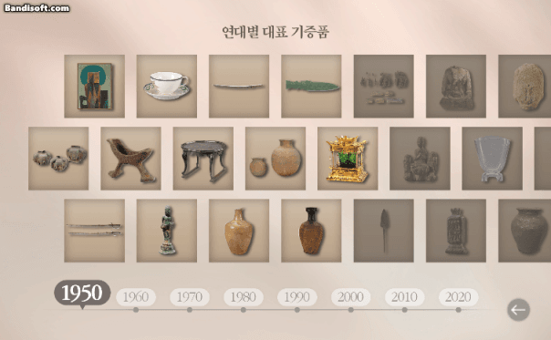 </td>
    <td> 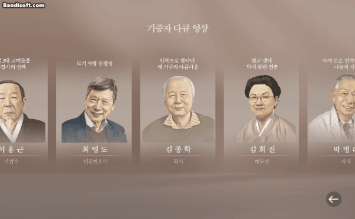 </td>
    <td> 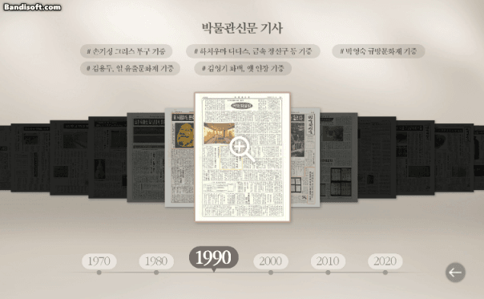 </td>
  </tr>
  <tr> 
    <td colspan="3" align="center"> 국립중앙박물관 </td>
  </tr>
 </table>

### 🎥 카메라 (Camera)
관람객이 전시 콘텐츠를 다각도에서 직관적으로 감상할 수 있도록 구현한 3차원 조작 시스템입니다.  
<table width="100%">
  <tr>
    <th width="33.3%">사물 회전</th>
    <th width="33.3%">시점 회전</th>
    <th width="33.3%">핀치 줌</th>
  </tr>
  <tr>
    <td> 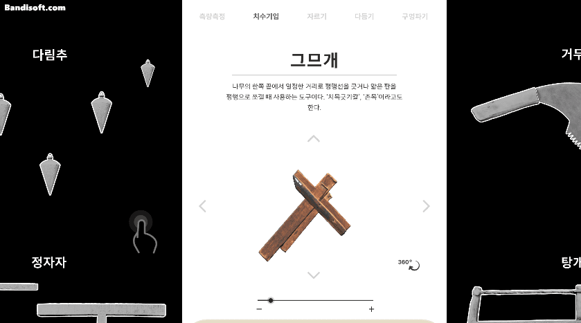 </td>
    <td> 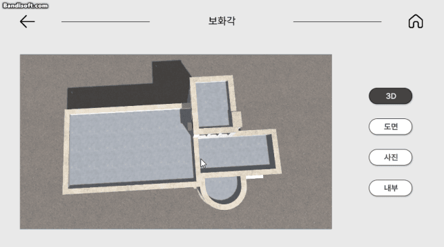 </td>
    <td> 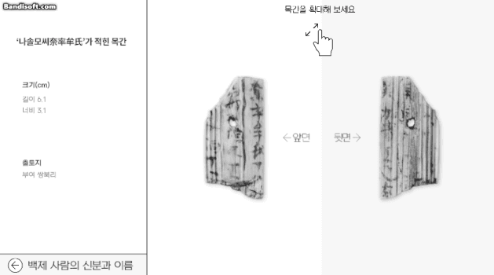 </td>
  </tr>
  <tr align="center">
    <td> LH토지주택박물관 </td>
    <td> 간송미술관 </td>
    <td> 국립부여박물관 </td>
  </tr>
 </table>

## 인터랙티브 (Interactive)
현장 관람객의 신체 움직임과 디바이스 조작을 실시간으로 감지하여, 공간 전체와 유기적으로 상호작용하는 인터랙티브 미디어 시스템입니다.

### 📡 센서 (Sensors)
관람객의 행동 유도에 최적화된 특수 센서를 연동하여, 직관적인 비접촉 제어와 인터랙티브 공간을 구현합니다.
<table width="100%" >
  <tr>
    <th width="33.3%">제스쳐 인식 (키넥트)</th>
    <th width="33.3%">벽면 터치 (라이다 센서)</th>
    <th width="33.3%">에어 마우스 (VR 트래커)</th>
  </tr>
  <tr>
    <td> 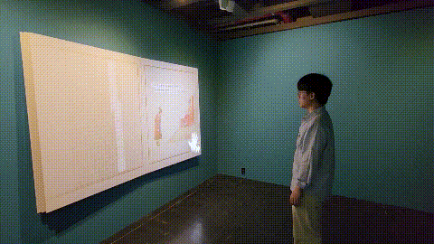 </td>
    <td> 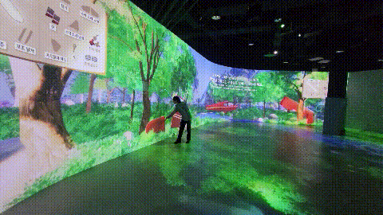 </td>
    <td> 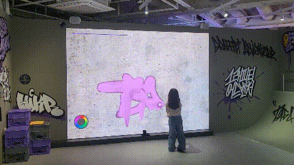 </td>
  </tr>
  <tr align="center">
    <td> 수도국산달동네박물관 </td>
    <td> 국립항공박물관 </td>
    <td> 한국관광공사 </td>
  </tr>
 </table>

### 👁️ 컴퓨터 비전 (Computer Vision)
카메라 영상 데이터를 실시간으로 추적·분석하여, 관람객의 움직임이나 환경 변화를 즉각적으로 콘텐츠에 반영하는 비전 기술입니다.
<table width="100%" >
  <tr>
    <th>얼굴 인식 (Google MediaPipe)</th>
  </tr>
  <tr>
    <td> 
      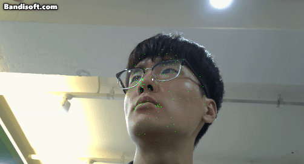
      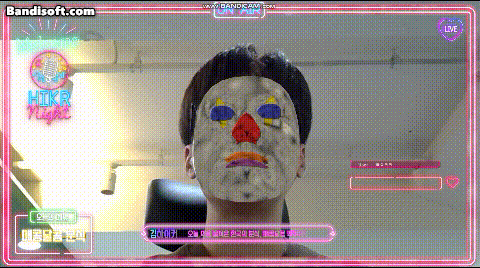
      
    </td>
  </tr>
  <tr align="center">
    <td> 한국관광공사 </td>
  </tr>
 </table>

### 🔌 시리얼 통신 (RS232)
하드웨어 장치와 PC 간의 로컬 시리얼 통신 연동 기술로, **RFID 및 바코드** 등의 인식 센서 데이터를 실시간으로 수신하여 콘텐츠를 제어합니다.
<table width="100%">
  <tr>
    <th colspan="2"> RFID 인식 후 미디어 교체 </th>
  </tr>
  <tr>
    <td> 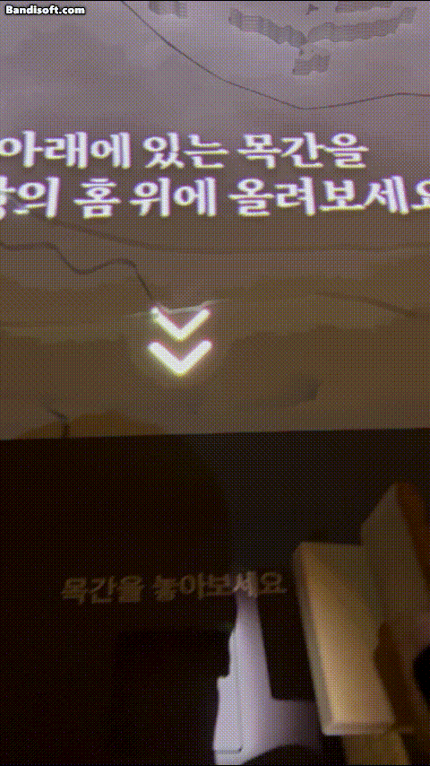 </td>
    <td>
      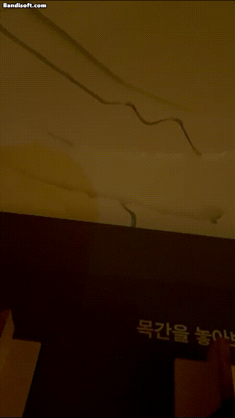
       &nbsp;&nbsp;&nbsp; 
      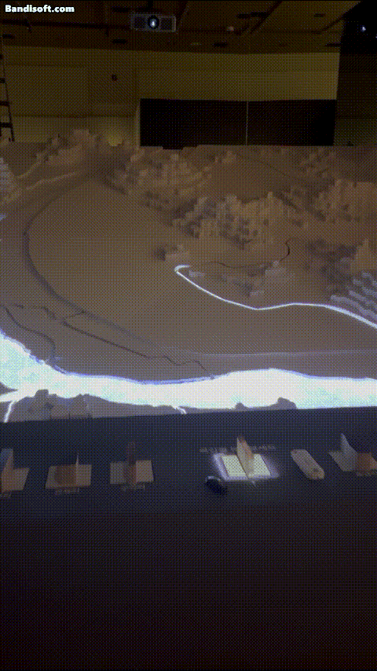
    </td>
  </tr>
  <tr> 
    <td colspan="2" align="center"> 국립부여박물관 </td>
  </tr>
 </table>

## 기타 및 R&D
독립형 하드웨어 연동 단계를 넘어, 여러 기기 간의 유기적인 로컬 통신 구조 설계 및 차세대 비전 알고리즘을 연구·적용한 결과물입니다.  

### 🔗 멀티 디바이스 콘텐츠 (Multi-Device)
외부 서버 없이 로컬 네트워크 환경에서 1:N 구조로 실시간 동기화되어 구동되는 독립형 멀티플레이어 아키텍처입니다.
<table width="100%" >
  <tr>
    <th width="47.5%">개발 테스트 (서버 1, 클라이언트 1)</th>
    <th width="52.5%">운영 테스트 (서버 1, 클라이언트 3)</th>
  </tr>
  <tr>
    <td> 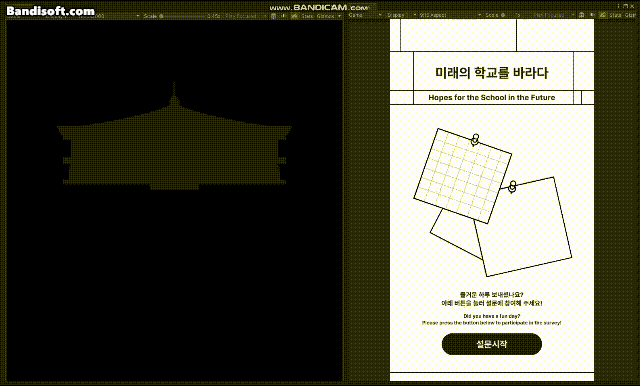 </td>
    <td> 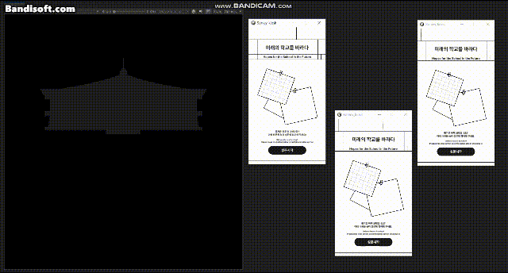 </td>
  </tr>
  <tr align="center">
    <td colspan="2"> 국립경주박물관 </td>
  </tr>
 </table>

### 🧪 R&D
지능형 전시 공간 구축을 위해 진행된 자체 연구개발(R&D) 성과입니다.  
<table width="100%" >
  <tr>
    <th colspan="2"> 비전 방식 실시간 공간 분할 </th>
  </tr>
  <tr>
    <td> 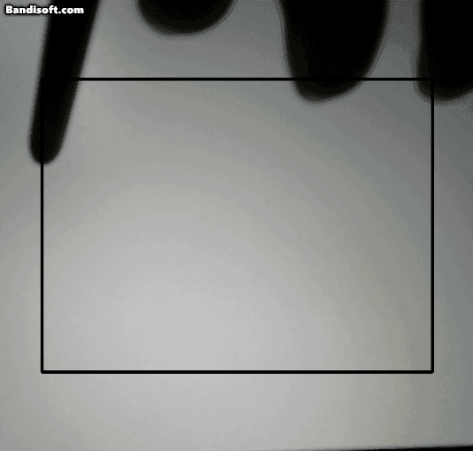 </td>
    <td> 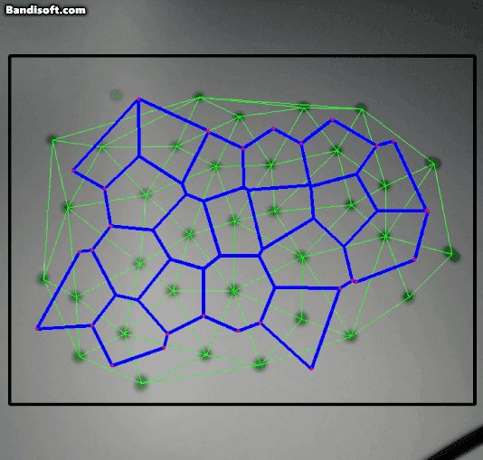 </td>
  </tr>
  <tr>
    <td colspan="2"> <b>델로네 삼각분할</b>을 이용하여 시각적으로 균형잡힌 삼각형을 만들고 (초록색 부분) <b>보로노이 다이어그램</b>을 이용하여 자연스럽고 유기적인 공간을 분할합니다. (파란색 부분)</td>
  </tr>
 </table>
